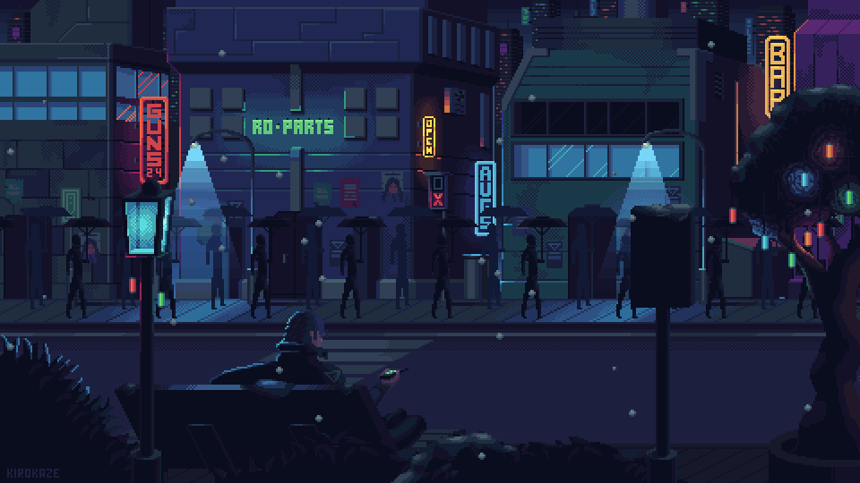

# ✌︎㋡ Hello, folks!


```text
                                          ___           ___                       ___                   
                                         /  /\         /  /\          ___        /  /\                  
                                        /  /::\       /  /::\        /__/|      /  /:/_                 
                                       /  /:/\:\     /  /:/\:\      |  |:|     /  /:/ /\    ___     ___ 
                                      /  /:/~/::\   /  /:/~/:/      |  |:|    /  /:/ /:/_  /__/\   /  /\
                                     /__/:/ /:/\:\ /__/:/ /:/___  __|__|:|   /__/:/ /:/ /\ \  \:\ /  /:/
                                     \  \:\/:/__\/ \  \:\/:::::/ /__/::::\   \  \:\/:/ /:/  \  \:\  /:/ 
                                      \  \::/       \  \::/~~~~     ~\~~\:\   \  \::/ /:/    \  \:\/:/  
                                       \  \:\        \  \:\           \  \:\   \  \:\/:/      \  \::/   
                                        \  \:\        \  \:\           \__\/    \  \::/        \__\/    
                                         \__\/         \__\/                     \__\/
```

<p align="center">
  
</p>

[](https://www.linkedin.com/in/aryel-souza/)
[](mailto:aryel.aryano@gmail.com)


<code></code>
<code></code>
<code></code>
<code></code>
<code></code>
<code></code>
<code></code>
<code></code>

- 📚 I'm a Computer Engineering student at the Federal Institute of Science and Technology
- 🔭 I am studying to become a Hardware Engineer and Game Dev!
- 🌱 I’m currently studying embedded systems with STM32
- 💬 Ask me about anything!




